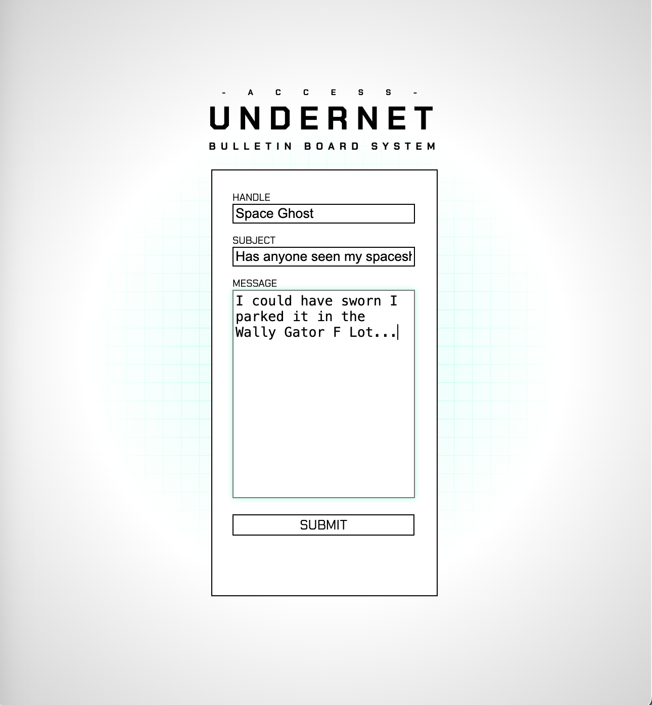
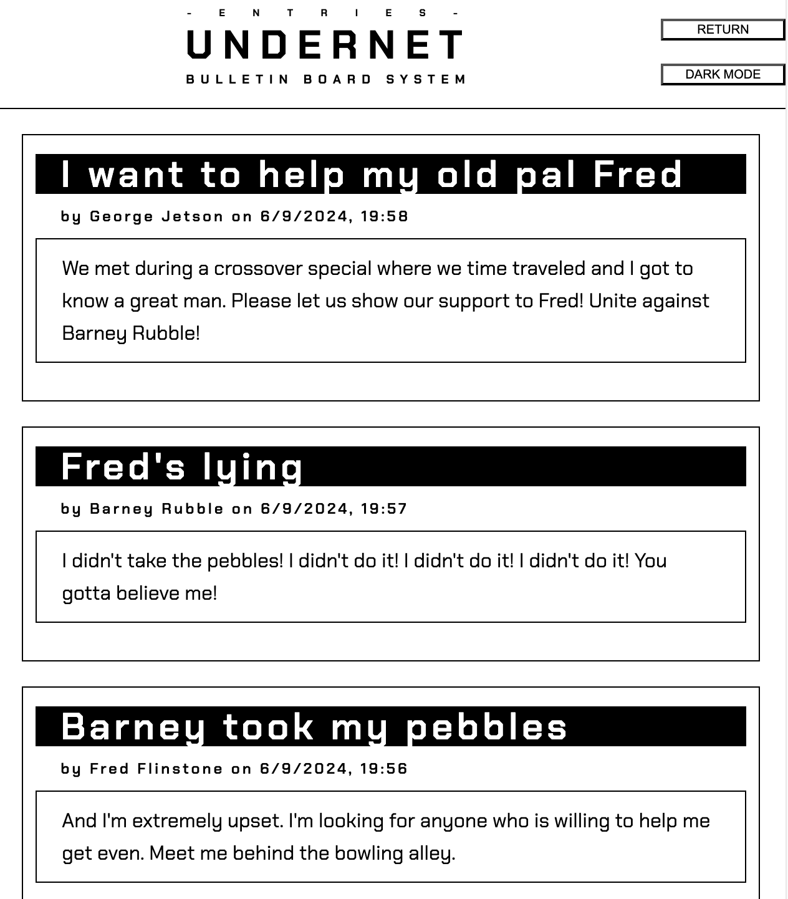
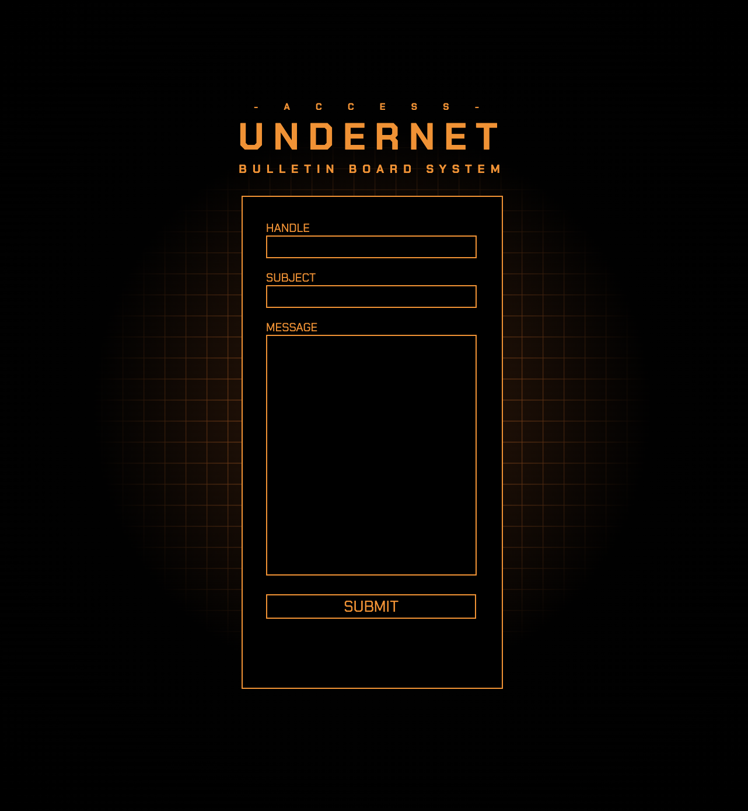
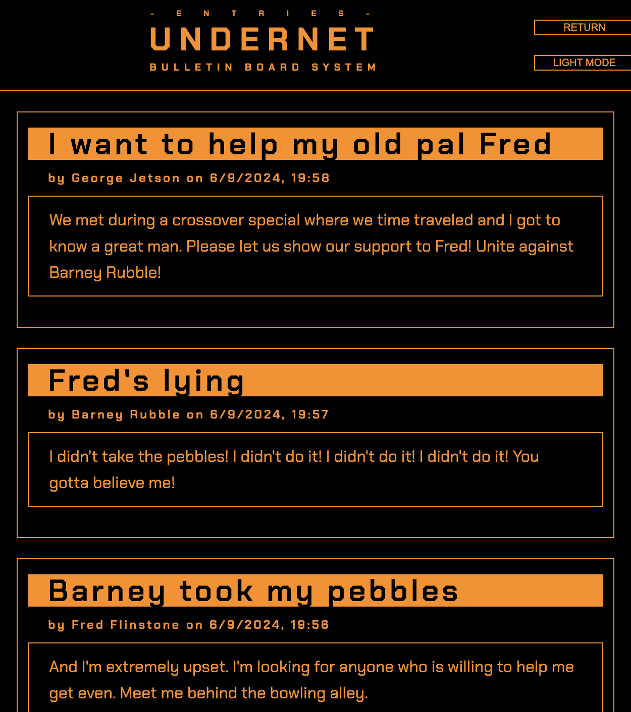

# Personal Blog

## Description

Bootcamp Challenge 04 Wep APIs: Code Builder - For this project student is tasked to build code from scratch. The assignment is to create a mock-Blog functionality. This consists of two webpages. The first consists of a form which will take user input (Name, Subject, Post content). The second page takes the user's posts and populates an HTML page with a list of the posts. This is achievable by storing posts in Local Storage and pulling to populate the 2nd page.

To make things interesting we've also been tasked to implement a Light and Dark Mode functionality that can be freely switched between by the user.

## User Story

```md
AS A marketing student,
I WANT a personal blog
SO THAT I can showcase my thoughts and experiences.
```

## Acceptance Criteria

```md
GIVEN a personal blog
WHEN I load the app,
THEN I am presented with the landing page containing a form with labels and inputs for username, blog title, and blog content.
WHEN I submit the form,
THEN blog post data is stored to localStorage.
WHEN the form submits,
THEN I am redirected to the posts page.
WHEN I enter try to submit a form without a username, title, or content,
THEN I am presented with a message that prompts me to complete the form.
WHEN I view the posts page,
THEN I am presented with a header, with a light mode/dark mode toggle, and a "Back" button.
WHEN I click the light mode/dark mode toggle,
THEN the page content's styles update to reflect the selection.
WHEN I click the "Back" button,
THEN I am redirected back to the landing page where I can input more blog entries.
WHEN I view the main content,
THEN I am presented with a list of blog posts that are pulled from localStorage.
WHEN I view localStorage,
THEN I am presented with a JSON array of blog post objects, each including the post author's username, title of the post, and post's content.
WHEN I take a closer look at a single blog entry in the list,
THEN I can see the title, the content, and the author of the post.
WHEN I view the footer,
THEN I am presented with a link to the developer's portfolio.
```

## Preview






## Credits

- mdn web docs
- W3Schools
- The Coding Boot Camp at UT Austin